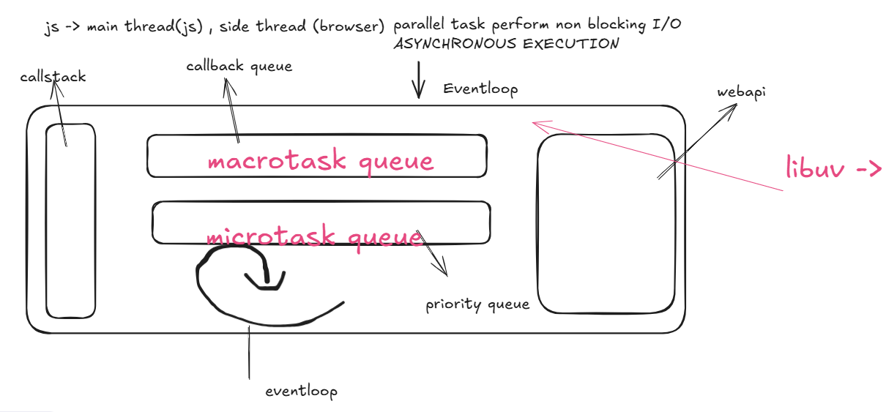

node js eventloop phases

1. Timer Phase -> Execute callback scheduled timer
setTimeout, setInterval once delayed passed.

2. Pending callback phase -> Execute I/O related 
callback preferred by os

3. Idel/prepare phase -> Internal arrangement by node/libuv

4. poll phase-> core phase waits for incoming I/O
events and eceutes I/O callbacks, if queue is empty, it can block

5. check phase -> executes callbacks for resource closing (setImmediate)

6. close callback phase -> close resource by 
using "socket.on("close")"

microtask queue - process.nextTick()
macrotask Queue - promise.resolve();

